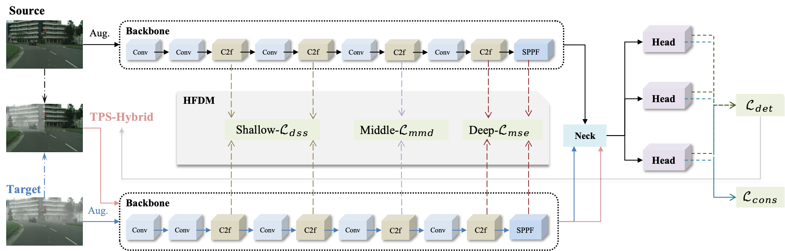

# HFDNet

## Introduction
This is our PyTorch implementation of the paper "[`Hierarchical Feature Differentiation-guided Network for domain adaptation object detection`].

<div align="center">
    
</div>

## Dataset Preparing
```bash
Cityscapes → Foggy Cityscapes
    Cityscapes: https://www.cityscapes-dataset.com/downloads/
        `Images leftImg8bit_trainvaltest.zip (11GB) [md5].
        `Annotations gtFine_trainvaltest.zip (241MB) [md5].
    Foggy CityScapes: https://www.cityscapes-dataset.com/downloads/. 
        `Images leftImg8bit_trainval_foggyDBF.zip (20GB) [md5]. 
        `Annotations are the same with `CityScapes`. 
Sim10K → Cityscapes
    Sim10K : https://fcav.engin.umich.edu/projects/driving-in-the-matrix
Pascal VOC → Clipart1k
    PascalVOC(2007+2012): follow the scripts in .dataset/VOC.yaml to build VOC datasets.
    Clipart1k: https://github.com/naoto0804/cross-domain-detection.
Public power data 
    CPLID: https://github.com/InsulatorData/InsulatorDataSet.
    VPMBGI: https://github.com/phd-benel/VPMBGI.
    # IDID: https://ieee-dataport.org/competitions/insulator-defect-detection.

🔔 '.yaml' file is in https://drive.google.com/drive/folders/1aqQfeHzpxAiJBeITXhvD-Bw0PZnLeeP0
```

## Weight
Since github can't upload large files, we uploaded the weights of the four benchmark tasks to the [Google Drive](https://drive.google.com/drive/my-drive)

## Quick Start Examples

###### Install
```bash
# clone the project and configure the environment.
git clone https://github.com/LiuJiaji1999/HFDNet.git
# the version of ultralytics is '8.2.50'           
# GPU-NVIDIA GeForce RTX 3090 
# CPU-12th Gen Intel(R) Core(TM) i9-12900

pip install -r DA-requirements.txt
统计信息:
  - Pip 包数量: 154
  - Conda-only 包数量: 50
  - 系统库数量: 2

需要注意的特殊包:
  - opencv-python==4.9.0.80
  - opencv-python-headless==4.10.0.84
  - torch==1.12.1+cu113
  - torchvision==0.13.1+cu113

# python: 3.8.18
# torch:  1.12.0+cu113
# torchvision: 0.13.0+cu113 
# numpy: 1.22.3   
```

###### Test & Detect
```bash
python val.py
python detect.py
```

###### Train
```bash
python train.py
# nohup python train.py > /home/lenovo/data/liujiaji/powerGit/dayolo/logs/improve/c2f.log 2>&1 & tail -f /home/lenovo/data/liujiaji/powerGit/dayolo/logs/improve/c2f.log
------------------------
Thank you for the open-source code. [https://github.com/stars/LiuJiaji1999/lists/reference-da]
### DACA
cd DACA
conda activate DA [albumentations==1.4.2,numpy=1.22.3 最合适的版本匹配]
nohup bash run.sh > run.log 2>&1 &
1.(Pre-adaptation): 先用源域进行监督训练，带标签
# 只有 car 类别
# nohup python train.py --name sim10k --epochs 20 --data data/sim10k2cityscapes.yaml --weights yolov5s.pt > /home/lenovo/data/liujiaji/powerGit/dayolo/logs/daca-pre-sim10k2city.log 2>&1 & tail -f /home/lenovo/data/liujiaji/powerGit/dayolo/logs/daca-pre-sim10k2city.log
# nohup python train.py --name cityscapes --epochs 20 --data data/cityscapes2foggy.yaml --weights yolov5s.pt > /home/lenovo/data/liujiaji/powerGit/dayolo/logs/daca-pre-city2foggy.log 2>&1 & tail -f /home/lenovo/data/liujiaji/powerGit/dayolo/logs/daca-pre-city2foggy.log
# nohup python train.py --name domestic --epochs 20 --data /home/lenovo/data/liujiaji/powerGit/dayolo/domain/domestic_to_foreign.yaml --weights yolov5s.pt > /home/lenovo/data/liujiaji/powerGit/dayolo/logs/other/daca-pre-d2f.log 2>&1 & tail -f /home/lenovo/data/liujiaji/powerGit/dayolo/logs/other/daca-pre-d2f.log
nohup python train.py --name publicpower --epochs 20 --data /home/lenovo/data/liujiaji/powerGit/dayolo/domain/publicpower_to_privatepower.yaml --weights yolov5s.pt > /home/lenovo/data/liujiaji/powerGit/dayolo/logs/other/daca-pre-pu2pr.log 2>&1 & tail -f /home/lenovo/data/liujiaji/powerGit/dayolo/logs/other/daca-pre-pu2pr.log

2.Training (Oracles):
# nohup python train.py --name oraclecityscapes --epochs 20 --data data/cityscapes.yaml --weights yolov5s.pt > /home/lenovo/data/liujiaji/powerGit/dayolo/logs/oracle-city.log 2>&1 & tail -f /home/lenovo/data/liujiaji/powerGit/dayolo/logs/oracle-city.log
# nohup python train.py --name oraclefoggy --epochs 20 --data data/foggycityscapes.yaml --weights yolov5s.pt > /home/lenovo/data/liujiaji/powerGit/dayolo/logs/oracle-foggy.log 2>&1 & tail -f /home/lenovo/data/liujiaji/powerGit/dayolo/logs/oracle-foggy.log
# nohup python train.py --name oraclepublic --epochs 20 --data /home/lenovo/data/liujiaji/powerGit/dayolo/domain/foreign.yaml --weights yolov5s.pt > /home/lenovo/data/liujiaji/powerGit/dayolo/logs/other/daca-oraclefo.log 2>&1 & tail -f /home/lenovo/data/liujiaji/powerGit/dayolo/logs/other/daca-oraclefo.log
nohup python train.py --name oraclepublic --epochs 20 --data /home/lenovo/data/liujiaji/powerGit/dayolo/domain/publicpower.yaml --weights yolov5s.pt > /home/lenovo/data/liujiaji/powerGit/dayolo/logs/other/daca-oraclepu.log 2>&1 & tail -f /home/lenovo/data/liujiaji/powerGit/dayolo/logs/other/daca-oraclepu.log

3.(DACA-based adaptation):
albumentations/transformer.py 警告信息太多：
# nohup python -W ignore uda_daca_train.py --name sim10k2cityscapes_daca --epochs 50 --data data/sim10k2cityscapes.yaml --weights runs/train/sim10k/weights/last.pt > /home/lenovo/data/liujiaji/powerGit/dayolo/logs/daca-sim10k2city.log 2>&1 & tail -f /home/lenovo/data/liujiaji/powerGit/dayolo/logs/daca-sim10k2city.log
# nohup python -W ignore uda_daca_train.py --name cityscapes2foggy_daca --epochs 50 --data data/cityscapes2foggy.yaml --weights runs/train/cityscapes/weights/best.pt > /home/lenovo/data/liujiaji/powerGit/dayolo/logs/daca-city2foggy.log 2>&1 & tail -f /home/lenovo/data/liujiaji/powerGit/dayolo/logs/daca-city2foggy.log  
# nohup python -W ignore uda_daca_train.py --name domestic2foreign_daca --epochs 50 --data /home/lenovo/data/liujiaji/powerGit/dayolo/domain/domestic_to_foreign.yaml --weights runs/train/domestic/weights/best.pt > /home/lenovo/data/liujiaji/powerGit/dayolo/logs/other/daca-d2f.log 2>&1 & tail -f /home/lenovo/data/liujiaji/powerGit/dayolo/logs/other/daca-d2f.log
nohup python -W ignore uda_daca_train.py --name public2private_daca --epochs 50 --data /home/lenovo/data/liujiaji/powerGit/dayolo/domain/publicpower_to_privatepower.yaml --weights runs/train/publicpower/weights/best.pt > /home/lenovo/data/liujiaji/powerGit/dayolo/logs/other/daca-pu2pr.log 2>&1 & tail -f /home/lenovo/data/liujiaji/powerGit/dayolo/logs/other/daca-pu2pr.log

4.Validation
# source-only
python val.py  --name exp  --data data/sim10k2cityscapes.yaml  --weights runs/train/sim10k/weights/best.pt 
python val.py  --name exp  --data data/cityscapes2foggy.yaml  --weights runs/train/cityscapes/weights/best.pt 
# oracle
python val.py  --name exp  --data data/sim10k2cityscapes.yaml --weights /home/lenovo/data/liujiaji/DACA/runs/train/oraclecityscapes/weights/best.pt 
python val.py  --name exp  --data data/cityscapes2foggy.yaml --weights /home/lenovo/data/liujiaji/DACA/runs/train/oraclefoggy/weights/best.pt 
# daca
python val.py  --name exp  --data data/sim10k2cityscapes.yaml  --weights runs/train/sim10k2cityscapes_daca/weights/best.pt 
python val.py  --name exp  --data data/cityscapes2foggy.yaml  --weights runs/train/cityscapes2foggy_daca/weights/best.pt

------------------------

### SF-YOLO
conda activate DA
Sim10k: train set size:7000 val set size:1000 test set size:2000
/home/lenovo/data/liujiaji/Datasets-DA/Sim10k/images

## city2foggy
# 1. Extract target training data :
cd TargetAugment_train
python extract_data.py --scenario_name city2foggy --images_folder /home/lenovo/data/liujiaji/Datasets-DA/CityScapesFoggy/yolov5_format/images --image_suffix jpg
# 2. Then train the Target Augmentation Module :
## style_image: 如果 源图像 和 目标图像 的背景相似，那就是 目标图像的均值；否则就是随机的目标图像
nohup python train.py --scenario_name city2foggy --content_dir data/city2foggy --style_dir data/meanfoggy --vgg pre_trained/vgg16_ori.pth --save_dir models/city2foggy --n_threads=8 --device 0 > /home/lenovo/data/liujiaji/powerGit/dayolo/logs/sf-yolo-targetdata-city2foggy.log 2>&1 & tail -f /home/lenovo/data/liujiaji/powerGit/dayolo/logs/sf-yolo-targetdata-city2foggy.log
# 3. SF-YOLO adaptation
cd ..
nohup python train_sf-yolo.py --epochs 20 --batch-size 16 --data data/foggy_cityscapes.yaml --weights source_weights/cityscapes/yolov5s_cityscapes.pt --decoder_path TargetAugment_train/models/city2foggy/decoder_iter_160000.pth --encoder_path TargetAugment_train/pre_trained/vgg16_ori.pth --fc1 TargetAugment_train/models/city2foggy/fc1_iter_160000.pth --fc2 TargetAugment_train/models/city2foggy/fc2_iter_160000.pth --style_add_alpha 0.4 --style_path ./TargetAugment_train/data/meanfoggy/meanfoggy.jpg --SSM_alpha 0.5 --device 0 > /home/lenovo/data/liujiaji/powerGit/dayolo/logs/sf-yolo-city2foggy.log 2>&1 & tail -f /home/lenovo/data/liujiaji/powerGit/dayolo/logs/sf-yolo-city2foggy.log
# 4. val
python val.py --data data/foggy_cityscapes.yaml --weights runs/train/exp/weights/best_teacher.pt

## sim10k2city
cd TargetAugment_train
python extract_data.py --scenario_name sim10k2city --images_folder /home/lenovo/data/liujiaji/Datasets-DA/CityScapes/yolov5_format/images --image_suffix jpg
nohup python train.py --scenario_name sim10k2city --content_dir data/sim10k2city --style_dir data/meancity --vgg pre_trained/vgg16_ori.pth --save_dir models/sim10k2city --n_threads=8 --device 0 > /home/lenovo/data/liujiaji/powerGit/dayolo/logs/sf-yolo-targetdata-sim10k2city.log 2>&1 & tail -f /home/lenovo/data/liujiaji/powerGit/dayolo/logs/sf-yolo-targetdata-sim10k2city.log
cd ..
nohup python train_sf-yolo.py --epochs 20 --batch-size 16 --data data/cityscapes.yaml --weights source_weights/sim10k/yolov5s_sim10k.pt --decoder_path TargetAugment_train/models/sim10k2city/decoder_iter_160000.pth --encoder_path TargetAugment_train/pre_trained/vgg16_ori.pth --fc1 TargetAugment_train/models/sim10k2city/fc1_iter_160000.pth --fc2 TargetAugment_train/models/sim10k2city/fc2_iter_160000.pth --style_add_alpha 0.4 --style_path ./TargetAugment_train/data/meancity/aachen_000000_000019.jpg --SSM_alpha 0.5 --device 0 > /home/lenovo/data/liujiaji/powerGit/dayolo/logs/other/sf-yolo-sim10k2city-2.log 2>&1 & tail -f /home/lenovo/data/liujiaji/powerGit/dayolo/logs/other/sf-yolo-sim10k2city-2.log
# 4. val
python val.py --data data/cityscapes.yaml --weights runs/train/exp5/weights/best_teacher.pt

------------------------

### SSDA-YOLO
conda activate DA
clear-->foggy 
    train：Source -- labeled cityspace, Target -- unlabeled foggy cityspace
    test、val：labeled foggy cityspace
sunnny-->rainy
    train：Source -- labeled sunnny images, Target -- unlabeled rainy images
    test、val：extra labeled images from rainy 
## train
------- 多卡：python -m torch.distributed.launch --nproc_per_node 4 
# voc2clipart_ssda_960_yolov5l6
- python ssda_yolov5_train.py --weights weights/yolov5l.pt --data yamls_sda/pascalvoc0712_clipart1k_VOC.yaml --name voc2clipart_ssda_960_yolov5l --img 960 --device 0 --batch-size 6 --epochs 100 --lambda_weight 0.005 --consistency_loss --alpha_weight 2.0
- python ssda_yolov5_train.py --weights weights/yolov5l.pt --data yamls_sda/cityscapes_csfoggy_VOC.yaml --name cityscapes_csfoggy_ssda_960_yolov5l --img 960 --device 0 --batch-size 6 --epochs 100 --lambda_weight 0.005 --consistency_loss --alpha_weight 2.0

# If you want to resume a breakout training, following the script below.
------- 多卡： python -m torch.distributed.launch --nproc_per_node 4 -master_port 12345 
# voc2clipart_ssda_960_yolov5l_R
- python ssda_yolov5_train.py --weights weights/yolov5l.pt --data yamls_sda/pascalvoc0712_clipart1k_VOC.yaml --name voc2clipart_ssda_960_yolov5l_R --student_weight runs/train/voc2clipart_ssda_960_yolov5l4/weights/best_student.pt --teacher_weight runs/train/voc2clipart_ssda_960_yolov5l4/weights/best_teacher.pt --img 960 --device 0 --batch-size 6 --epochs 200 --lambda_weight 0.005 --consistency_loss --alpha_weight 2.0
# cityscapes_csfoggy_ssda_960_yolov5l_R
- python ssda_yolov5_train.py --weights weights/yolov5l.pt --data yamls_sda/cityscapes_csfoggy_VOC.yaml --name cityscapes_csfoggy_ssda_960_yolov5l_R --student_weight runs/train/cityscapes_csfoggy_ssda_960_yolov5l/weights/best_student.pt --teacher_weight runs/train/cityscapes_csfoggy_ssda_960_yolov5l/weights/best_teacher.pt --img 960 --device 0 --batch-size 6 --epochs 100 --lambda_weight 0.005 --consistency_loss --alpha_weight 2.0

## test
python ssda_yolov5_test.py --data yamls_sda/pascalvoc0712_clipart1k_VOC.yaml --weights runs/train/voc2clipart_ssda_960_yolov5l6/weights/best_student.pt --name voc2clipart_ssda_960_yolov5l --img 960 --batch-size 6 --device 0
python ssda_yolov5_test.py --data yamls_sda/cityscapes_csfoggy_VOC.yaml --weights runs/train/cityscapes_csfoggy_ssda_960_yolov5l_R/weights/best_student.pt --name cityscapes_csfoggy_ssda_960_yolov5l --img 960 --batch-size 6 --device 0

💡ALL LOGS ARE IN https://github.com/LiuJiaji1999/power/tree/main/dayolo
```

###### Dual-input
```bash
/ultralytics/models/yolo/model.py
/ultralytics/models/yolo/detect/__init__.py 
/ultralytics/models/yolo/detect/uda_train.py
/ultralytics/data/uda_build.py  # load dataset  def uda_build_dataloader
/ultralytics/nn/uda_tasks.py  # update model structure
/ultralytics/engine/uda_trainer.py # update trainer
/ultralytics/utils/daca.py # compute loss 
/ultralytics/engine/validator.py  # loss
/ultralytics/cfg/default.yaml # add weight value
/ultralytics/nn/modules/head.py # head pseudo
/ultralytics/utils/plotting.py # output_to_target

```


#### Explanation of the file
```bash
# Main scripts
train.py: script to train the model
val.py: script that calculates metrics using the trained model
detect.py: inference script
# Other scripts
distill.py: distill script
export.py: export onnx scripts
gap.py: /gap 
get_FPS.py: script to calculate model storage size, model inference time-FPS
heatmap.py: script to generate heat map
main_profile.py : a script that outputs the model and the parameters and calculations for each layer of the model
track.py : script to track inference
```

### References
Reference code links are all [HERE](https://github.com/stars/LiuJiaji1999/lists/reference-da), thanks to the spirit of open source.


